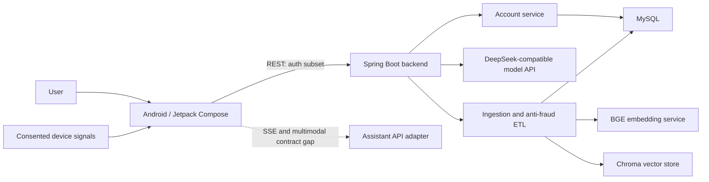

# FanZha - Intelligent Anti-Fraud Assistant

FanZha（反诈通）是一个面向个人风险咨询、可疑内容识别与家庭安全提醒的智能反诈项目。仓库采用移动端与后端同库维护：Android 客户端负责多模态交互、本地 OCR、设备侧风险采集与提醒；Spring Boot 后端负责账户、AI 调用、资料入库、反诈资讯 ETL、关系型存储与向量索引。

项目强调“辅助判断”而非替代公安、银行或平台风控。模型结果需要以可解释提示、用户确认和人工处置流程共同约束。

## Features

**Android 客户端**

- 文本、图片、音频、视频、链接和文件的统一风险分析入口
- ML Kit 本地中文 OCR，并支持低质量结果回退到服务端
- 支持上下文和附件的 AI 对话、SSE 增量展示
- 安全指数、风险等级、原因解释和处置建议
- 经用户授权的短信、通话、剪贴板和应用信息采集、去重与批量上报
- 风险通知、家庭守护、举报、学习内容、深色与大字模式界面

**Spring Boot 后端**

- 邮箱或手机号注册、登录与 BCrypt 密码存储
- DeepSeek 兼容的非流式 AI 对话接口
- TXT、JSON、CSV、HTML、ZIP 等资料解析、脱敏与指纹计算
- 反诈资讯抓取、清洗、可信度过滤、结构化抽取和 MySQL 持久化
- Chroma 向量入库与查询，保留独立 Milvus 适配器
- Actuator、Prometheus 指标与 OpenAPI 文档
- MySQL / Chroma / Backend 的 Docker Compose 开发环境

## Capability Status

| Area | Status | Notes |
| --- | --- | --- |
| Android UI, OCR and device integration | Implemented | 可独立构建并运行本地能力 |
| Android REST/SSE orchestration | Implemented on client | 需要兼容服务端 |
| Backend registration/login | Implemented | 尚未签发访问令牌 |
| Backend AI chat | Implemented | `POST /ai/chat`，需要外部模型密钥 |
| Ingestion and ETL | Implemented, opt-in | 默认不注册上传/运维接口 |
| MySQL and Chroma integration | Implemented | Compose 可启动依赖服务 |
| Full Android/backend contract alignment | In progress | 当前后端不是 Android 全部接口的直接替代品 |
| Family, interception dashboard and alert APIs | Client contract only | 本后端尚未实现 |

## System Architecture



模块边界、数据流和已知差距见 [系统架构文档](docs/architecture.md)。

## Technology Stack

| Layer | Technologies |
| --- | --- |
| Android | Kotlin 2.2, Jetpack Compose, Coroutines, Retrofit, OkHttp, Gson, ML Kit OCR, Coil |
| Backend | Java 8, Spring Boot 2.7, Spring Web, Spring Data JPA, Spring Batch, Bean Validation |
| AI / Data | DeepSeek-compatible API, BGE embeddings, Chroma, experimental Milvus adapter, MySQL 8 |
| Crawling / Parsing | OkHttp, Jsoup, Playwright, Tess4J, HanLP |
| Observability | Spring Boot Actuator, Micrometer, Prometheus |
| Delivery | Gradle, Maven, Docker Compose, GitHub Actions |

Redis、JWT、WebSocket 与完整 RAG 问答链路并未在当前代码中实现，因此不作为已交付技术栈描述。

## Installation

### 1. Clone

```bash
git clone https://github.com/MagicVVu/FanZha.git
cd FanZha
```

### 2. Start the backend

Requirements: Docker Engine with Compose, or JDK 8 + Maven 3.8+ + MySQL 8.

```bash
cd backend
cp .env.example .env
# Replace DB_PASSWORD and MYSQL_ROOT_PASSWORD in .env
docker compose up --build
```

The backend listens on `http://localhost:8080`; health is available at `/actuator/health`. AI, crawler, ingestion and admin operations stay disabled until their environment variables are explicitly enabled. See [backend/README.md](backend/README.md) and [deployment guide](docs/deployment.md).

### 3. Configure Android

Copy values from `config/local.properties.example` into the ignored root `local.properties`:

```properties
api.base.url=http://10.0.2.2:8080/
ai.api.base.url=http://10.0.2.2:8080/
```

`10.0.2.2` maps the Android emulator to the host machine. The current backend directly supports the client registration/login calls, but the assistant SSE/multimodal endpoints still require an adapter or additional implementation.

### 4. Build and test

Android on Windows:

```powershell
.\gradlew.bat :app:testDebugUnitTest :app:assembleDebug
```

Backend:

```bash
cd backend
./mvnw -B -ntp verify
```

## API Documentation

- Runtime OpenAPI: `http://localhost:8080/v3/api-docs`
- Swagger UI: `http://localhost:8080/swagger-ui.html`
- Implemented endpoint and Android compatibility matrix: [docs/api.md](docs/api.md)

## Project Structure

```text
FanZha/
├── .github/workflows/       # Android and backend CI
├── app/                     # Android application
├── backend/                 # Spring Boot API, ETL and AI integration
│   ├── src/main/
│   ├── src/test/
│   ├── scripts/
│   ├── Dockerfile
│   └── docker-compose.yml
├── config/                  # Android-safe configuration templates
├── database/                # Auditable MySQL schema
├── docs/                    # Architecture, API, deployment and security
├── gradle/                  # Gradle wrapper and version catalog
├── CONTRIBUTING.md
├── build.gradle.kts
└── settings.gradle.kts
```

Runtime datasets, crawler cookies, Playwright profiles, vector database files, build outputs and credentials are intentionally excluded.

## Security and Privacy

The Android application can process communications and device metadata; the backend accepts user content and can invoke paid model APIs. Production deployment requires a privacy policy, TLS, authentication/authorization, rate limiting, upload isolation, audit logs and retention/deletion controls. Admin and ingestion endpoints are off by default because token-based authorization is not implemented yet. Review [security and privacy notes](docs/security-and-privacy.md) before external distribution.

## Future Improvement

- Add access/refresh token issuance, role-based authorization and rate limiting
- Align the backend with the Android SSE and multimodal assistant contract
- Implement family, interception, alert-command and profile APIs
- Replace unmanaged background threads with a durable job queue and observable job state
- Adopt Flyway or Liquibase for versioned schema migration
- Add Testcontainers integration tests for MySQL and Chroma contracts
- Introduce retrieval evaluation datasets and measurable anti-fraud quality benchmarks
- Encrypt sensitive client state and complete data export/deletion workflows

## License

No open-source license is currently granted. Source and bundled assets remain subject to their respective owners' rights until a project-wide license and third-party asset review are completed.
