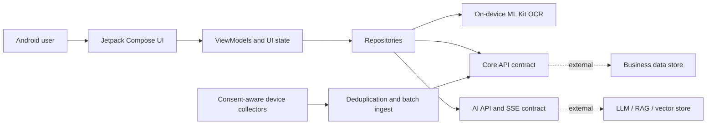

# FanZha - Intelligent Anti-Fraud Assistant

FanZha（反诈通）是一个面向移动端风险识别与家庭守护场景的 Android 客户端。项目将多模态内容提交、AI 连续对话、本地 OCR、风险提醒和设备侧安全数据采集整合在统一交互中，帮助用户在转账、客服理赔、可疑链接、陌生来电等高风险场景下更快获得可解释的风险提示。

> 本仓库公开的是 Android 客户端与服务端 API 契约。模型服务、RAG 知识库、数据库以及服务端实现不在当前仓库中；相关能力只有在接入兼容后端后才能完整运行。

## Features

- 文本、图片、音频、视频、网站链接和文件的统一风险分析入口
- 图片本地 OCR 优先策略，低质量结果可回退到服务端分析
- 支持附件与上下文的 AI 反诈助手，使用 SSE 增量展示结果
- 安全指数、风险等级、原因解释和处置建议展示
- 短信、通话记录、剪贴板和已安装应用的授权采集、增量去重与批量上报
- 风险指令轮询、系统通知、声音和震动提醒
- 用户资料、家庭成员、拦截统计、学习内容与举报流程界面
- 深色模式、大字模式和适老化交互支持

## Capability status

| Area | Status | Evidence in this repository |
| --- | --- | --- |
| Android UI and navigation | Implemented | Compose screens, components and state holders |
| Local image OCR | Implemented | ML Kit Chinese text recognition |
| Multimodal request orchestration | Implemented | Retrofit multipart requests and aggregation logic |
| Streaming assistant | Implemented on client | OkHttp SSE parsing; requires AI service |
| Device risk collection | Implemented on client | Consent gate, collectors, watermarks and batch ingest |
| Authentication/profile/family data | Client contract implemented | Requires core API service |
| LLM, RAG and vector search | External dependency | No model or knowledge-base server source in this repository |
| SMS OTP verification | Integration pending | Local opt-in value is available only for development |
| Report progress and learning feeds | Partly local | Some screens currently use bundled/static content |

## System Architecture



The client follows an incremental layered structure:

`Compose UI -> ViewModel -> Repository -> remote/local data source`

See [architecture documentation](docs/architecture.md) for module boundaries, critical flows and known engineering trade-offs.

## Technology Stack

**Android**

- Kotlin 2.2
- Jetpack Compose and Material 3
- AndroidX ViewModel and Kotlin Coroutines
- Retrofit, OkHttp and Gson
- ML Kit Chinese OCR
- Coil for image, GIF and SVG loading
- SharedPreferences-based local persistence

**Quality and delivery**

- Gradle 9.3 / Android Gradle Plugin 9.1
- JUnit, Robolectric and Compose UI tests
- GitHub Actions build and unit-test workflow

**External service contracts**

- REST APIs for account, profile, family and interception data
- Multipart analysis APIs for multimodal content
- Server-Sent Events for streaming assistant responses
- The server-side LLM, RAG, vector database and persistence technology are not specified by this client repository

## Installation

### Prerequisites

- Android Studio with Android SDK 36
- JDK 17 or the Android Studio embedded runtime
- A device or emulator running Android 8.1 (API 27) or later
- Compatible core and AI API services for network-backed features

### Configure

1. Clone the repository.
2. Open the repository root in Android Studio.
3. Copy the required values from `config/local.properties.example` into the root `local.properties` generated by Android Studio.
4. Set `api.base.url` and `ai.api.base.url` to your HTTPS service endpoints.

The same values can be injected in CI or a shell through `FANZHA_API_BASE_URL` and `FANZHA_AI_API_BASE_URL`. No production endpoint or credential is committed to source control.

### Build and test

Windows:

```powershell
.\gradlew.bat :app:testDebugUnitTest :app:assembleDebug
```

macOS or Linux:

```bash
./gradlew :app:testDebugUnitTest :app:assembleDebug
```

The debug APK is generated under `app/build/outputs/apk/debug/`. For device permissions, release signing and troubleshooting, see [deployment documentation](docs/deployment.md).

## API Documentation

The Android client defines contracts for:

- authentication and registration
- user profiles, occupations and security scores
- family-member management
- interception dashboards, history and batch ingest
- AI chat, multimodal analysis, SMS checks and report advice
- risk-notification commands and quiz scores

Endpoint paths, request ownership and integration assumptions are documented in [docs/api.md](docs/api.md).

## Project Structure

```text
FanZha/
├── .github/workflows/       # Continuous integration
├── app/                     # Android application module
│   └── src/
│       ├── main/            # Production code and resources
│       ├── test/            # JVM/Robolectric tests
│       └── androidTest/     # Instrumented Compose tests
├── config/                  # Safe local configuration templates
├── docs/                    # Architecture, API, deployment and security docs
├── gradle/                  # Version catalog and Gradle wrapper
├── CONTRIBUTING.md
├── build.gradle.kts
└── settings.gradle.kts
```

There are no empty `backend/` or `database/` directories: those sources were not present in the supplied project and are not represented as implemented.

## Security and privacy

This application can request access to SMS, call logs, notifications and installed-app metadata. Collection starts only after an in-app consent step and must be paired with a production privacy policy, data-retention rules and server-side authorization. See [security and privacy notes](docs/security-and-privacy.md) before distributing the application.

## Future Improvement

- Replace client-side development OTP support with a server-issued challenge and verification flow
- Move from activity-managed route state to Navigation Compose graphs
- Introduce dependency injection and interfaces around all remote data sources
- Replace frequent alarm polling with push delivery or constrained background work
- Encrypt sensitive local state and define deletion/retention controls
- Add contract tests against a versioned API schema and reproducible multimodal benchmarks
- Modularize assistant, identification and security-ingest features as the codebase grows
