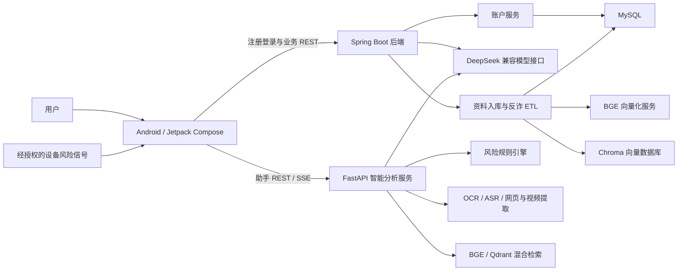

# 反诈通——智能反诈助手

反诈通（FanZha）是一个面向个人风险咨询、可疑内容识别与家庭安全提醒的智能反诈项目。仓库采用多模块单仓库结构：Android 客户端负责多模态交互、本地 OCR、设备侧风险采集与提醒；FastAPI 智能分析服务负责流式对话、多模态内容提取、规则判定与知识库增强检索；Spring Boot 后端负责账户、资料入库、反诈资讯 ETL 和关系型存储。

项目强调“辅助判断”而非替代公安、银行或平台风控。模型结果需要以可解释提示、用户确认和人工处置流程共同约束。

## 核心功能

**Android 客户端**

- 文本、图片、音频、视频、链接和文件的统一风险分析入口
- ML Kit 本地中文 OCR，并支持低质量结果回退到服务端
- 支持上下文和附件的 AI 对话、SSE 增量展示
- 安全指数、风险等级、原因解释和处置建议
- 经用户授权的短信、通话、剪贴板和应用信息采集、去重与批量上报
- 风险通知、家庭守护、举报、学习内容、深色与大字模式界面

**Spring Boot 后端**

- 邮箱或手机号注册、登录与 BCrypt 密码存储
- DeepSeek 兼容的非流式 AI 对话接口
- TXT、JSON、CSV、HTML、ZIP 等资料解析、脱敏与指纹计算
- 反诈资讯抓取、清洗、可信度过滤、结构化抽取和 MySQL 持久化
- Chroma 向量入库与查询，保留独立 Milvus 适配器
- Actuator、Prometheus 指标与 OpenAPI 文档
- MySQL、Chroma 和后端服务的 Docker Compose 开发环境

**智能分析服务**

- 文本、图片、音频、视频、网页和文件的统一分析流水线
- 普通对话、多附件对话和 SSE 增量响应
- PaddleOCR、Faster Whisper、FFmpeg 与 Playwright 内容提取
- 规则引擎高风险兜底、BGE/Qdrant 混合检索与二阶段重排
- 新型诈骗案例候选、令牌保护的人工复核与知识库重建
- 外部模型不可用时的本地规则和知识库降级

## 能力完成度

| 领域 | 状态 | 说明 |
| --- | --- | --- |
| Android 界面、OCR 与设备集成 | 已实现 | 可独立构建并运行本地能力 |
| Android REST/SSE 请求编排 | 已实现 | 智能分析服务已提供兼容接口 |
| 后端注册与登录 | 已实现 | 尚未签发访问令牌 |
| 后端 AI 对话 | 已实现 | `POST /ai/chat`，需要外部模型密钥 |
| 多模态智能分析服务 | 已实现 | `/api/assistant/*`，支持 SSE、附件与短信检测 |
| 混合检索与人工复核 | 已实现 | Qdrant 可选；无向量库时使用词法检索降级 |
| 资料入库与 ETL | 已实现，按需启用 | 默认不注册上传和运维接口 |
| MySQL 与 Chroma 集成 | 已实现 | Docker Compose 可启动依赖服务 |
| Android 与服务端完整契约对齐 | 部分完成 | 助手接口已对齐，家庭守护与风险看板仍待实现 |
| 家庭守护、拦截看板与风险指令 API | 仅有客户端契约 | 当前后端尚未实现 |

## 系统架构



模块边界、数据流和已知差距见[系统架构文档](docs/architecture.md)。

## 技术栈

| 层级 | 技术 |
| --- | --- |
| Android | Kotlin 2.2、Jetpack Compose、Coroutines、Retrofit、OkHttp、Gson、ML Kit OCR、Coil |
| 后端 | Java 8、Spring Boot 2.7、Spring Web、Spring Data JPA、Spring Batch、Bean Validation |
| 智能分析服务 | Python 3.11、FastAPI、Uvicorn、Pydantic、SSE |
| AI 与数据 | DeepSeek 兼容接口、规则引擎、BGE Embedding、Qdrant、Chroma、MySQL 8 |
| 抓取与解析 | OkHttp、Jsoup、Playwright、Tess4J、HanLP |
| 可观测性 | Spring Boot Actuator、Micrometer、Prometheus |
| 工程交付 | Gradle、Maven、Docker Compose、GitHub Actions |

Redis、JWT 与 WebSocket 并未在当前代码中实现，因此不作为已交付技术栈描述。流式对话使用 SSE。

## 安装与运行

### 1. 克隆仓库

```bash
git clone https://github.com/MagicVVu/FanZha.git
cd FanZha
```

### 2. 启动后端

环境要求：Docker Engine 与 Docker Compose；也可以使用 JDK 8、Maven 3.8+ 和 MySQL 8 手动启动。

```bash
cd backend
cp .env.example .env
# 修改 .env 中的 DB_PASSWORD 和 MYSQL_ROOT_PASSWORD
docker compose up --build
```

后端默认监听 `http://localhost:8080`，健康检查地址为 `/actuator/health`。AI、爬虫、资料入库和管理操作默认关闭，只有显式设置环境变量后才会启用。详细说明见[后端说明](backend/README.md)和[部署文档](docs/deployment.md)。

### 3. 启动智能分析服务

推荐使用 Docker 构建包含 OCR、语音识别、浏览器和 FFmpeg 的完整环境：

```bash
cd ../ai-service
cp .env.production.example .env.production
# 设置 DEEPSEEK_API_KEY 和 ADMIN_REVIEW_TOKEN
docker compose up --build -d
```

智能分析服务通过 Nginx 监听 `http://localhost:80`，健康检查地址为 `/health`。未配置模型密钥时，规则引擎与本地知识库仍可提供降级结果。详见[智能分析服务说明](ai-service/README.md)。

### 4. 配置 Android 客户端

参考 `config/local.properties.example`，在仓库根目录被 Git 忽略的 `local.properties` 中配置：

```properties
api.base.url=http://10.0.2.2:8080/
ai.api.base.url=http://10.0.2.2/
```

`10.0.2.2` 用于让 Android 模拟器访问宿主机。Spring Boot 服务处理注册登录，FastAPI 服务处理助手 SSE 和多模态分析。

### 5. 构建与测试

Windows 下构建 Android：

```powershell
.\gradlew.bat :app:testDebugUnitTest :app:assembleDebug
```

验证后端：

```bash
cd backend
./mvnw -B -ntp verify
```

验证智能分析服务的轻量测试：

```bash
cd ../ai-service
pip install -r requirements-test.txt
python -m unittest discover -s tests -p "test_*.py"
```

## API 文档

- 运行时 OpenAPI：`http://localhost:8080/v3/api-docs`
- Swagger UI：`http://localhost:8080/swagger-ui.html`
- 智能分析服务 OpenAPI：`http://localhost/docs`
- 已实现接口和 Android 兼容性矩阵：[API 文档](docs/api.md)

## 项目结构

```text
FanZha/
├── .github/workflows/       # Android 与后端持续集成
├── app/                     # Android 应用
├── ai-service/              # FastAPI 多模态智能分析与知识库服务
├── backend/                 # Spring Boot API、ETL 与 AI 集成
│   ├── src/main/
│   ├── src/test/
│   ├── scripts/
│   ├── Dockerfile
│   └── docker-compose.yml
├── config/                  # Android 安全配置模板
├── database/                # 可审查的 MySQL 表结构
├── docs/                    # 架构、API、部署与安全文档
├── gradle/                  # Gradle Wrapper 与版本目录
├── CONTRIBUTING.md
├── build.gradle.kts
└── settings.gradle.kts
```

上传内容、评测结果、爬虫 Cookie、模型缓存、向量数据库文件、构建产物和凭据均不会纳入版本控制。

## 安全与隐私

Android 应用可能处理通信内容和设备元数据；后端会接收用户内容，并可能调用计费模型接口。生产部署需要补充隐私政策、TLS、身份认证与授权、限流、上传隔离、审计日志，以及数据保留和删除机制。由于当前尚未实现令牌授权，管理与资料入库接口默认关闭。外部发布前请阅读[安全与隐私说明](docs/security-and-privacy.md)。

## 后续规划

- 增加访问令牌、刷新令牌、角色授权和限流
- 实现家庭守护、拦截记录、风险指令和用户资料接口
- 将音视频分析迁移到持久化异步任务队列，并增加资源配额
- 使用持久化任务队列和可观测任务状态替代进程内线程
- 引入 Flyway 或 Liquibase 管理数据库版本
- 使用 Testcontainers 增加 MySQL 与 Chroma 集成测试
- 扩展现有检索评测用例，建立持续质量基线与漂移监控
- 加密客户端敏感状态，并完成数据导出与删除流程

## 开源许可

当前仓库尚未授予开源许可证。在完成项目级许可证选择和第三方资源授权审查前，源码及随附资源仍受各自权利人约束。
