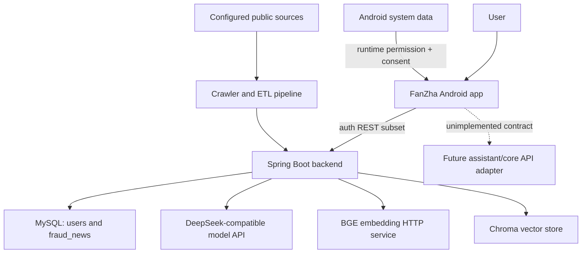
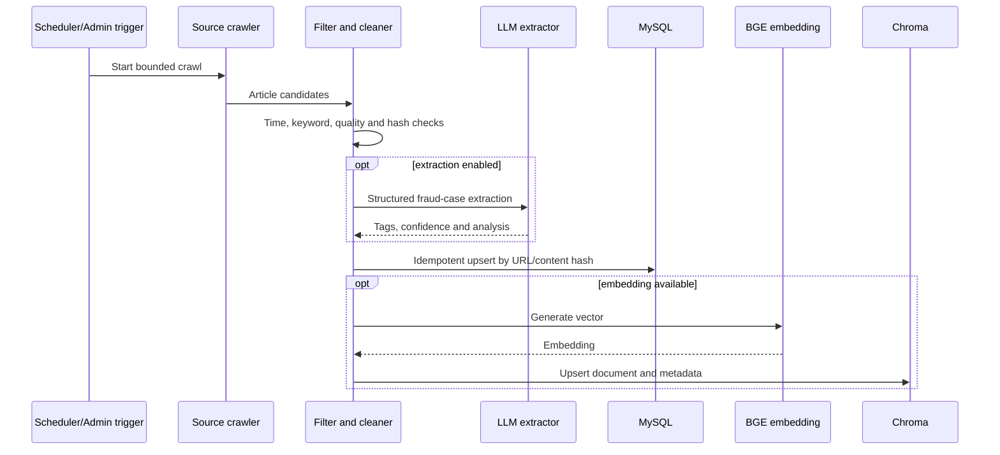

# System architecture

## Scope and boundaries

FanZha is a monorepo containing an Android client and a Spring Boot backend. The two projects share the anti-fraud domain but do not yet have complete API parity: registration/login are compatible at the path and envelope level; the Android assistant, family, dashboard, ingest and alert contracts exceed the current backend surface.

This distinction is intentional in the documentation: implemented code is separated from planned integration work.

## System context

External model, embedding and vector services are optional. Safe defaults keep automatic ETL, crawling, Chroma initialization and privileged HTTP endpoints disabled.

## Android architecture

| Layer | Responsibility | Key packages |
| --- | --- | --- |
| Presentation | Compose screens, reusable components and accessibility themes | `ui/screens`, `ui/components`, `ui/theme` |
| State orchestration | User actions, loading/error state and result aggregation | `ui/viewmodels` |
| Domain | Security index and risk rules | `domain` |
| Data | DTOs, Retrofit contracts, repositories and preferences | `data/model`, `data/remote`, `data/repository`, `data/local` |
| Device integration | OCR, content collection, notifications and receivers | `security`, `sms`, `notifications`, `util` |

The intended dependency direction is `UI -> ViewModel -> repository -> remote/local`. Some dependency construction remains in the application module and is a refactoring target.

## Backend architecture

| Layer | Responsibility | Key packages |
| --- | --- | --- |
| API | Request validation, response envelope and feature gating | `controller` |
| Application services | Authentication, ingestion, crawling, cleaning and ETL orchestration | `service` |
| Integration | DeepSeek, BGE, Chroma, Milvus, OSS, Playwright and HTTP clients | `util`, `service/chroma`, `service/fraud` |
| Persistence | JPA accounts and JDBC anti-fraud news storage | `dao`, `entity`, `service/fraud/storage` |
| Configuration | Typed properties, CORS, OpenAPI and infrastructure beans | `config` |

### Anti-fraud ETL flow

The repository includes two ETL paths: `KnowledgeBaseEtlService` for the earlier Baidu/DeepSeek/Chroma flow and `FraudNewsEtlService` for configurable multi-source collection and richer persistence. Both are disabled by default. Consolidation into one job model is recommended.

## Authentication and trust boundary

Passwords are stored as BCrypt hashes with compatibility migration for legacy salted SHA-256 records. The current login response returns user identity but no access token. Therefore:

- account endpoints are suitable for integration development, not a complete production identity system;
- ingestion and admin controllers require explicit feature flags and must remain behind a trusted network;
- callers cannot treat a user ID as proof of identity;
- API gateway authentication, application authorization and rate limiting remain required.

## Configuration boundary

Android service addresses come from ignored `local.properties` values or environment variables. Backend secrets and environment-specific values come from environment variables referenced by `application.yml`; `.env.example` contains names only.

Runtime datasets, crawler checkpoints, browser profiles and vector database files are outside source control. The committed `database/schema.sql` is the auditable baseline for application tables.

## Known limitations

- Android SSE/multimodal assistant paths are not implemented by the backend.
- Family, profile, interception dashboard and risk-command endpoints exist only as Android contracts.
- The backend has no JWT/session issuance or role-based authorization.
- Schema changes are not yet versioned with Flyway or Liquibase.
- Manual ETL currently starts an in-process daemon thread rather than a durable job.
- Milvus code is present but the active ETL pipeline uses Chroma.
- Some Android learning/report screens use bundled or local content.
