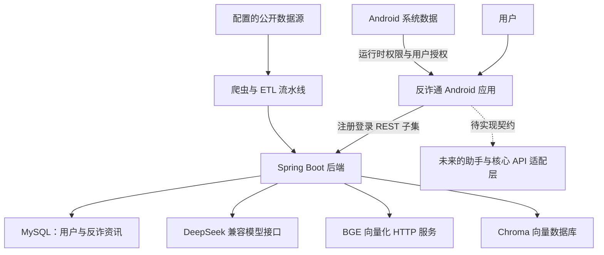
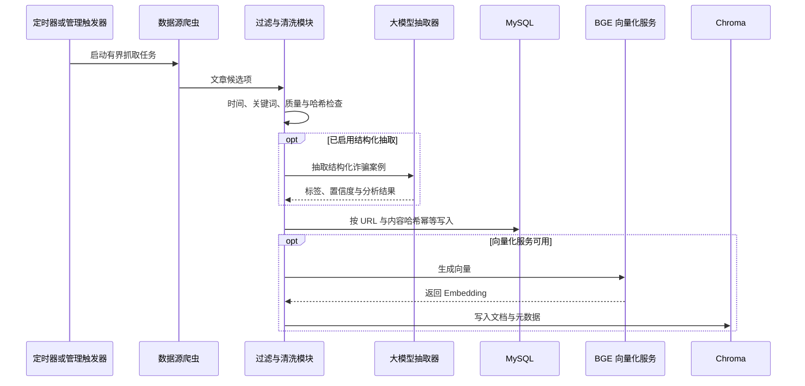

# 系统架构

## 范围与边界

反诈通采用单仓库结构，包含 Android 客户端和 Spring Boot 后端。两者共享反诈业务领域，但接口尚未完全对齐：注册和登录在路径及响应结构层面兼容；Android 助手、家庭守护、风险看板、数据上报和风险指令所需的契约超出当前后端能力范围。

文档会明确区分已实现代码与后续集成计划，避免把尚未存在的能力描述为已交付功能。

## 系统关系

外部模型、向量化和向量数据库服务均为可选依赖。安全默认配置会关闭自动 ETL、爬虫、Chroma 启动初始化和高权限 HTTP 接口。

## Android 客户端架构

| 层级 | 职责 | 主要包 |
| --- | --- | --- |
| 展示层 | Compose 页面、通用组件和无障碍主题 | `ui/screens`、`ui/components`、`ui/theme` |
| 状态编排 | 用户操作、加载与错误状态、结果聚合 | `ui/viewmodels` |
| 领域层 | 安全指数计算和风险规则 | `domain` |
| 数据层 | DTO、Retrofit 契约、仓储和偏好设置 | `data/model`、`data/remote`、`data/repository`、`data/local` |
| 设备集成 | OCR、内容采集、通知和广播接收 | `security`、`sms`、`notifications`、`util` |

预期依赖方向为 `界面 -> ViewModel -> 仓储 -> 远程或本地数据源`。部分依赖创建逻辑仍集中在应用模块中，后续需要重构。

## 后端架构

| 层级 | 职责 | 主要包 |
| --- | --- | --- |
| 接口层 | 请求校验、统一响应和功能开关 | `controller` |
| 应用服务层 | 身份认证、资料入库、抓取、清洗与 ETL 编排 | `service` |
| 外部集成层 | DeepSeek、BGE、Chroma、Milvus、OSS、Playwright 与 HTTP 客户端 | `util`、`service/chroma`、`service/fraud` |
| 持久化层 | JPA 用户账户和 JDBC 反诈资讯存储 | `dao`、`entity`、`service/fraud/storage` |
| 配置层 | 类型化配置、跨域、OpenAPI 和基础设施 Bean | `config` |

### 反诈资讯 ETL 流程

仓库中保留两条 ETL 路径：`KnowledgeBaseEtlService` 用于早期的百度、DeepSeek 与 Chroma 流程；`FraudNewsEtlService` 用于可配置多数据源采集和更完整的持久化。两者默认都关闭，后续建议统一为一套任务模型。

## 身份认证与信任边界

密码使用成本因子为 12 的 BCrypt 哈希保存；旧版加盐 SHA-256 记录会在成功登录后自动迁移。当前登录响应只返回用户身份信息，不签发访问令牌。因此：

- 账户接口适合联调开发，但不构成完整的生产身份系统；
- 资料入库和管理控制器必须通过显式开关启用，并限制在可信网络中；
- 调用方不得将用户 ID 视为身份凭证；
- 仍需补充 API 网关认证、应用层授权和限流。

## 配置边界

Android 服务地址来自被 Git 忽略的 `local.properties` 或环境变量。后端密钥和环境差异配置来自 `application.yml` 引用的环境变量；`.env.example` 只保留变量名称和安全示例。

运行数据集、爬虫检查点、浏览器用户目录和向量数据库文件均位于版本控制之外。仓库中的 `database/schema.sql` 是应用表结构的可审查基线。

## 已知限制

- 后端尚未实现 Android 所需的 SSE 与多模态助手接口。
- 家庭守护、用户资料、拦截看板和风险指令目前只有 Android 契约。
- 后端尚未签发 JWT 或会话，也没有角色授权。
- 数据库变更尚未通过 Flyway 或 Liquibase 进行版本化管理。
- 手动 ETL 仍使用进程内守护线程，不是持久化任务。
- Milvus 代码已经保留，但当前 ETL 主链路使用 Chroma。
- 部分 Android 学习与报告页面仍使用内置或本地内容。
