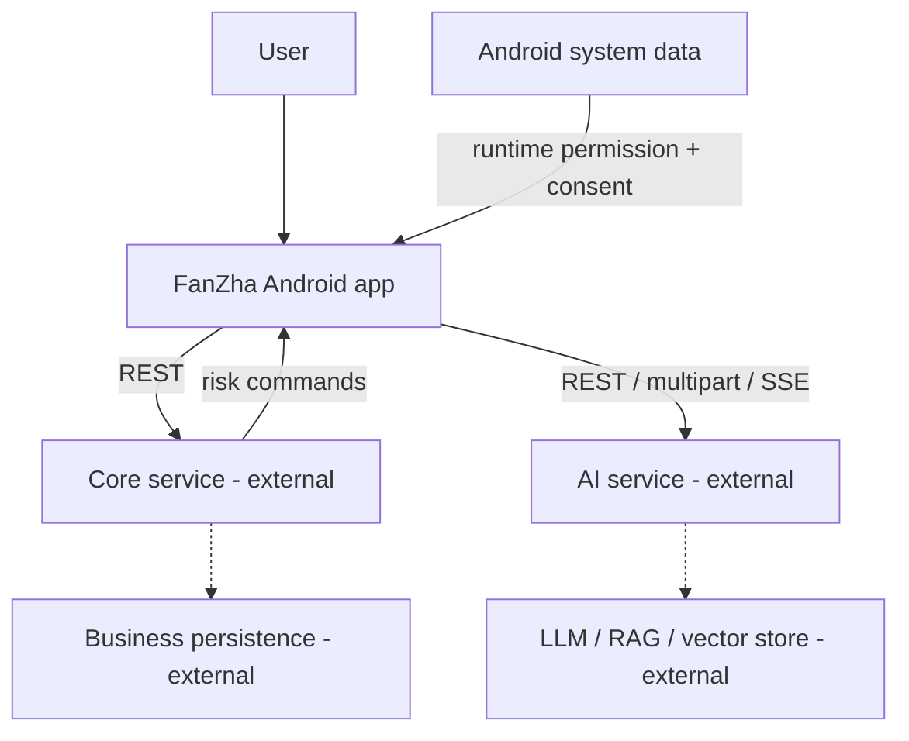
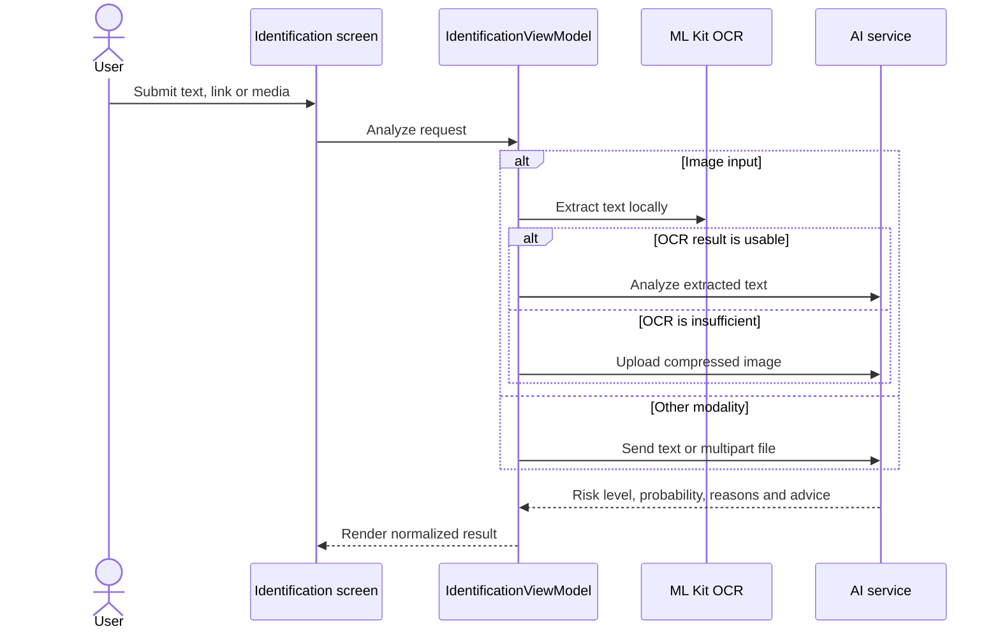

# System architecture

## Scope

FanZha is currently an Android client. It owns presentation, local device integration, request orchestration and client-side state. Authentication, business persistence, model inference, retrieval and knowledge-base lifecycle are external service responsibilities and are documented only as contracts.

## Context

The dashed components are not included in this repository. Their concrete framework and database cannot be inferred reliably from client code.

## Client layers

| Layer | Responsibility | Key packages |
| --- | --- | --- |
| Presentation | Compose screens, reusable components, accessibility themes | `ui/screens`, `ui/components`, `ui/theme` |
| State orchestration | User actions, loading/error state, aggregation | `ui/viewmodels` |
| Domain | Security-index calculation and risk-domain rules | `domain` |
| Data | DTOs, Retrofit contracts, repositories, preferences | `data/model`, `data/remote`, `data/repository`, `data/local` |
| Device integration | OCR, content collection, notification and broadcast handling | `security`, `sms`, `notifications`, `util` |

The intended dependency direction is `UI -> ViewModel -> repository -> remote/local`. A few screens still construct or reference clients directly; dependency injection is a planned refactor rather than an implemented feature.

## Critical flows

### Multimodal identification

Multiple media items are evaluated independently and then aggregated conservatively on the client.

### Streaming assistant

The assistant repository creates multipart requests and parses SSE frames. `start` initializes the session and recommendations, `delta` appends generated text, and `done` closes the response with risk metadata. The client keeps the session identifier and up to three pending attachments.

### Device-risk ingest

Collection is gated by user consent and Android runtime permissions. SMS, call-log, clipboard and installed-app collectors produce a shared payload. The ingest uploader uses timestamps and content fingerprints to avoid resending unchanged data, then posts a batch to the core service.

### Risk notifications

An alarm receiver polls three risk-command endpoints and coordinates Android notifications. The current short polling interval is sensitive to OEM power policies and battery use; production delivery should prefer push notifications or constrained background work.

## Configuration boundary

Two service addresses are explicit:

- `API_BASE_URL`: account, profile, family, dashboard and ingest APIs
- `AI_API_BASE_URL`: assistant, analysis, SMS checking and report advice

Values come from ignored `local.properties` keys or environment variables. Debug logging is disabled automatically for release builds. Cleartext traffic is enabled only when a configured endpoint explicitly uses `http://`; production deployments should use HTTPS.

## Known limitations

- The backend, model gateway and knowledge-base pipeline are not open-sourced here.
- Registration OTP has only an opt-in local integration value; it is not a production verification mechanism.
- Some learning and report-progress views use bundled/static content.
- Navigation and dependency construction remain concentrated in the application module.
- Several sensitive Android permissions require a distribution-channel and privacy review.
